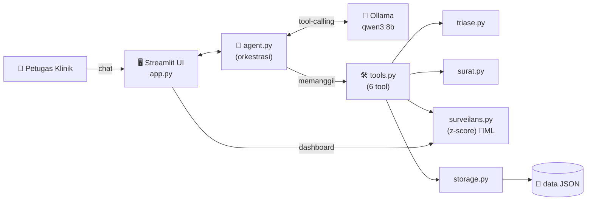
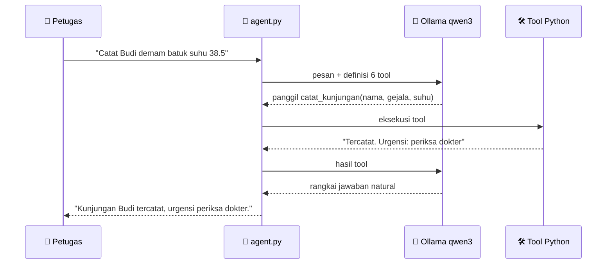

# 🏥 Asisten Poliklinik Taruna

> **Produk Agentic AI** untuk petugas poliklinik kampus: mendigitalkan pendataan
> pasien & surat keterangan sakit lewat **chat bahasa natural**, sekaligus
> **mendeteksi dini lonjakan gejala (potensi wabah)** di asrama menggunakan
> metode anomali statistik.


Proyek mata kuliah **Machine Learning** — Politeknik Siber dan Sandi Negara (Poltek SSN).

---

## ✨ Fitur Utama

| Fitur | Keterangan |
|-------|-----------|
| 💬 **Pencatatan via chat** | Petugas cukup mengetik keluhan; lokasi (blok/kompi/angkatan) terisi **otomatis** dari data induk |
| 🩺 **Triase otomatis** | Menilai tingkat urgensi (rawat mandiri → segera) — *bukan diagnosis* |
| 📄 **Surat keterangan sakit** | Draft surat tergenerate otomatis, siap cetak |
| 🦠 **Deteksi dini wabah** | Menandai lonjakan gejala per blok/kompi/angkatan dengan **z-score** (inti Machine Learning) |
| 📊 **Dashboard surveilans** | Grafik kasus harian + peringatan klaster real-time |
| 🔒 **Aman & privat** | 100% data sintetis, selalu ada *disclaimer* medis |

---

## 🎯 Latar Belakang & Masalah

Berdasarkan pengamatan proses di poliklinik kampus:

1. **Pendataan pasien masih manual** oleh petugas → lambat & rawan tidak konsisten.
2. **Surat keterangan sakit dibuat manual** → memakan waktu.
3. **Tidak ada pemantauan pola penyakit** → ketika banyak taruna sakit dengan
   gejala serupa di asrama padat, tidak ada peringatan dini potensi wabah.

**Value proposition:**
> Mengubah pendataan & surat poliklinik yang manual menjadi *satu asisten chat*,
> dan memantau lonjakan gejala per lokasi untuk **peringatan dini wabah**.

---

## 💡 Konsep: Apa itu "Agentic AI"?

Inti pembelajaran proyek ini: **LLM bertindak sebagai "otak" yang memilih dan
memanggil _tool_**, bukan mengerjakan semuanya sendiri.

- LLM **tidak** menghitung, mendeteksi wabah, atau menyimpan data sendiri.
- LLM hanya memutuskan **_tool_ mana yang dipanggil dengan argumen apa**.
- **Fungsi Python (tool)** yang melakukan pekerjaan nyata.

```
reasoning  →  pilih tool  →  bertindak  →  rangkai jawaban
```

Inilah yang membedakan *agentic AI* dari sekadar chatbot: model **mengambil
tindakan** melalui alat, bukan hanya menghasilkan teks.

---

## 🏗️ Arsitektur



## 🔄 Alur Kerja Agentic (contoh: mencatat pasien)



---

## 🛠️ Daftar Tool (6 tool agentic)

LLM memilih tool yang tepat sesuai maksud kalimat petugas:

| Tool | Fungsi | Contoh perintah |
|------|--------|-----------------|
| `catat_kunjungan` | Catat kunjungan; lokasi auto + triase auto | *"Catat Budi demam batuk suhu 38.5"* |
| `triase` | Menilai urgensi (bukan diagnosis) | *"Sesak napas itu seberapa urgen?"* |
| `buat_surat_sakit` | Draft surat keterangan sakit | *"Buatkan surat sakit Budi 2 hari"* |
| `cek_anomali` | Deteksi klaster/wabah per lokasi | *"Ada potensi wabah?"* |
| `rekap_harian` | Ringkasan kunjungan harian | *"Rekap hari ini"* |
| `riwayat_pasien` | Riwayat kunjungan seorang taruna | *"Riwayat berobat Budi"* |

---

## 🧠 Inti Machine Learning: Deteksi Anomali Statistik

Metode **surveilans sindromik**: membandingkan jumlah kasus hari ini dengan
*baseline* historis, per grup lokasi (blok/kompi/angkatan) dan per gejala.

Untuk grup lokasi dan gejala pada hari `t`:

```
c_t       = jumlah kasus gejala di grup itu pada hari t
baseline  = N hari sebelumnya (default 14) → rata-rata (μ) & simpangan baku (σ)
z         = (c_t − μ) / σ
FLAG "potensi klaster" bila  z ≥ 2  DAN  c_t ≥ 3
```

- **z-score** dipilih karena *explainable* dan jalan dengan data sedang.
- Ambang `c_t ≥ 3` mencegah alarm palsu saat angka kecil.
- Disediakan pula fungsi **uji Poisson** sebagai pembanding (di `surveilans.py`).

**Contoh keluaran nyata** (lonjakan demam di Blok A terdeteksi):

```
⚠️ Kompi 1: 5 kasus 'demam' (baseline 0.29±0.45, z=10.44)
⚠️ Blok A:  7 kasus 'demam' (baseline 0.29±0.70, z=9.59)
⚠️ Kompi 2: 3 kasus 'demam' (baseline 0.14±0.35, z=8.16)
```

---

## 📁 Struktur Proyek

```
e-poliklinik/
├── app.py            # UI Streamlit: chat + dashboard surveilans
├── agent.py          # otak agentic: Ollama + tool-calling
├── tools.py          # 6 tool agentic + skema untuk LLM
├── triase.py         # aturan klasifikasi urgensi
├── surat.py          # generator surat keterangan sakit
├── surveilans.py     # deteksi anomali (z-score + Poisson)  ← inti ML
├── storage.py        # baca/tulis data JSON
├── seed_data.py      # generator data dummy (master + kunjungan)
├── data/             # master_taruna.json, kunjungan.json, config.json
├── tests/            # 28 unit test (pytest)
└── requirements.txt
```

---

## 🚀 Instalasi & Menjalankan

**Prasyarat:** Python 3.10+ dan [Ollama](https://ollama.com).

```bash
# 1. Install dependencies
pip install -r requirements.txt

# 2. Siapkan model LLM lokal (mendukung tool-calling)
ollama pull qwen3:4b        # ringan (~2.6 GB), muat di GPU 6 GB VRAM
# Ganti model tanpa edit kode:  set POLIKLINIK_MODEL=qwen3:8b  (butuh VRAM >= 8 GB)

# 3. Buat data dummy (jalankan di hari demo agar lonjakan di tanggal terbaru)
python seed_data.py

# 4. Jalankan aplikasi
streamlit run app.py         # buka http://localhost:8501
```

---

## 💬 Contoh Penggunaan

| Ketik di chat | Yang terjadi |
|---------------|--------------|
| `Catat Dewi Pratama, demam dan batuk, suhu 38.6` | ✅ Tercatat + triase "periksa dokter" |
| `Buatkan surat sakit Dewi Pratama istirahat 2 hari` | ✅ Draft surat tergenerate |
| `Ada potensi wabah?` | ⚠️ Klaster demam Blok A (z=9.59) terdeteksi |
| `Rekap hari ini` | 📊 Ringkasan jumlah & sebaran kunjungan |
| `Sesak napas dan nyeri dada itu urgen?` | 🚨 Urgensi: **Segera** + disclaimer |

---

## ✅ Pengujian

Dikembangkan dengan **Test-Driven Development (TDD)** — tulis uji dulu, lalu
implementasi. Seluruh logika inti tercakup.

```bash
pytest -v
```

```
28 passed
```

| Modul | Test |
|-------|------|
| `storage.py` | 4 |
| `triase.py` | 7 |
| `surat.py` | 3 |
| `surveilans.py` (inti ML) | 3 |
| `seed_data.py` | 3 |
| `tools.py` | 6 |
| `agent.py` (mock) | 2 |

---

## 🔒 Keamanan & Privasi

- **100% data sintetis** (± 60 taruna palsu) — tidak memakai data taruna asli.
  Pilihan sadar untuk melindungi data pribadi, relevan dengan konteks keamanan siber.
- **Bukan alat diagnosis.** Tool `triase` selalu menempelkan *disclaimer* bahwa
  keputusan medis ada pada tenaga kesehatan. Sistem tidak mendiagnosis/meresepkan.
- **Berjalan sepenuhnya lokal** (LLM via Ollama) — tanpa mengirim data ke cloud.

---

## ⚙️ Teknologi

| Komponen | Pilihan |
|----------|---------|
| LLM | Ollama + `qwen3:4b` (tool-calling, lokal; muat di GPU 6 GB) |
| Orkestrasi | Library `ollama` (Python) |
| Analitik | `pandas`, `numpy` |
| Penyimpanan | File JSON (tanpa server) |
| Antarmuka | Streamlit |
| Pengujian | pytest |

---

## 🚧 Keterbatasan & Pengembangan Lanjut

- `cek_anomali` memeriksa **tanggal terbaru** — untuk demo, jalankan `seed_data.py`
  di hari-H agar lonjakan jatuh pada tanggal terbaru.
- Model lokal kecil kadang perlu prompt yang tegas untuk tool-calling.
- **Rencana lanjut:** impor data master via CSV, pembandingan metode z-score vs
  Poisson di laporan, notifikasi otomatis saat klaster terdeteksi.

---

## 👤 Penulis

**Muhammad Ezra Dhiatara** — NPM **2322101945**
Politeknik Siber dan Sandi Negara · Mata Kuliah Machine Learning

---

## 📄 Lisensi

Proyek akademik. Seluruh data bersifat sintetis/dummy.
