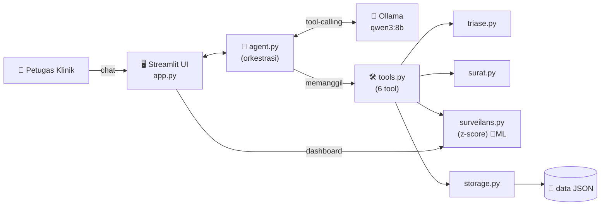
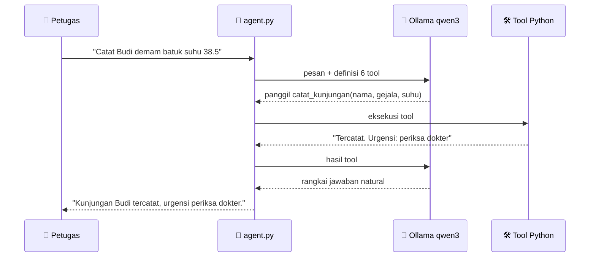

# 🏥 Asisten Poliklinik Taruna

> **Produk Agentic AI** untuk petugas poliklinik kampus: mendigitalkan pendataan
> pasien & surat keterangan sakit lewat **chat bahasa natural**, sekaligus
> **mendeteksi dini lonjakan gejala (potensi wabah)** di asrama menggunakan
> metode anomali statistik.


Proyek mata kuliah **Machine Learning** — Politeknik Siber dan Sandi Negara (Poltek SSN).

---

## ✨ Fitur Utama

| Fitur | Keterangan |
|-------|-----------|
| 💬 **Pencatatan via chat** | Petugas cukup mengetik keluhan; lokasi (blok/kompi/angkatan) terisi **otomatis** dari data induk |
| 🩺 **Triase otomatis** | Menilai tingkat urgensi (rawat mandiri → segera) — *bukan diagnosis* |
| 📄 **Surat keterangan sakit** | Draft surat tergenerate otomatis, siap cetak |
| 🦠 **Deteksi dini wabah** | Menandai lonjakan gejala per blok/kompi/angkatan dengan **z-score** (inti Machine Learning) |
| 📊 **Dashboard surveilans** | Grafik kasus harian + peringatan klaster real-time |
| 🔒 **Aman & privat** | 100% data sintetis, selalu ada *disclaimer* medis |

---

## 🎯 Latar Belakang & Masalah

Berdasarkan pengamatan proses di poliklinik kampus:

1. **Pendataan pasien masih manual** oleh petugas → lambat & rawan tidak konsisten.
2. **Surat keterangan sakit dibuat manual** → memakan waktu.
3. **Tidak ada pemantauan pola penyakit** → ketika banyak taruna sakit dengan
   gejala serupa di asrama padat, tidak ada peringatan dini potensi wabah.

**Value proposition:**
> Mengubah pendataan & surat poliklinik yang manual menjadi *satu asisten chat*,
> dan memantau lonjakan gejala per lokasi untuk **peringatan dini wabah**.

---

## 💡 Konsep: Apa itu "Agentic AI"?

Inti pembelajaran proyek ini: **LLM bertindak sebagai "otak" yang memilih dan
memanggil _tool_**, bukan mengerjakan semuanya sendiri.

- LLM **tidak** menghitung, mendeteksi wabah, atau menyimpan data sendiri.
- LLM hanya memutuskan **_tool_ mana yang dipanggil dengan argumen apa**.
- **Fungsi Python (tool)** yang melakukan pekerjaan nyata.

```
reasoning  →  pilih tool  →  bertindak  →  rangkai jawaban
```

Inilah yang membedakan *agentic AI* dari sekadar chatbot: model **mengambil
tindakan** melalui alat, bukan hanya menghasilkan teks.

---

## 🏗️ Arsitektur



## 🔄 Alur Kerja Agentic (contoh: mencatat pasien)



---

## 🛠️ Daftar Tool (6 tool agentic)

LLM memilih tool yang tepat sesuai maksud kalimat petugas:

| Tool | Fungsi | Contoh perintah |
|------|--------|-----------------|
| `catat_kunjungan` | Catat kunjungan; lokasi auto + triase auto | *"Catat Budi demam batuk suhu 38.5"* |
| `triase` | Menilai urgensi (bukan diagnosis) | *"Sesak napas itu seberapa urgen?"* |
| `buat_surat_sakit` | Draft surat keterangan sakit | *"Buatkan surat sakit Budi 2 hari"* |
| `cek_anomali` | Deteksi klaster/wabah per lokasi | *"Ada potensi wabah?"* |
| `rekap_harian` | Ringkasan kunjungan harian | *"Rekap hari ini"* |
| `riwayat_pasien` | Riwayat kunjungan seorang taruna | *"Riwayat berobat Budi"* |

---

## 🔍 Apa yang deterministik, apa yang LLM?

Pemisahan ini disengaja: **keputusan yang harus dapat dipertanggungjawabkan
tidak diserahkan ke LLM.** LLM hanya menerjemahkan maksud kalimat menjadi
pemanggilan tool; seluruh angka, keputusan urgensi, dan alarm wabah dihitung
oleh kode deterministik yang dapat diuji.

| Komponen | Deterministik | LLM | Keterangan |
|----------|:-------------:|:---:|------------|
| Pemilihan tool & argumen dari kalimat petugas | | ✅ | Satu-satunya peran LLM |
| Perumusan jawaban natural | | ✅ | Berdasarkan keluaran tool, bukan pengetahuan model |
| Pencarian data taruna, penyimpanan kunjungan | ✅ | | `storage.py`, `tools.py` |
| Penilaian urgensi (triase) | ✅ | | `triase.py` - aturan eksplisit, bukan tebakan model |
| Deteksi klaster/wabah | ✅ | | `surveilans.py` - statistik murni |
| Penyusunan surat keterangan sakit | ✅ | | `surat.py` - templat tetap |
| Rekap & riwayat | ✅ | | Agregasi langsung dari JSON |

Konsekuensinya: **hasil deteksi wabah tidak berubah walau model LLM diganti**,
dan seluruh logika inti dapat diuji tanpa menyalakan LLM sama sekali (73 unit
test berjalan tanpa Ollama).

---

## 📏 Evaluasi Kuantitatif Detektor Wabah

Klaim "sistem mendeteksi wabah" tidak cukup diucapkan - ia harus **diukur**.
`evaluasi.py` membangkitkan dataset sintetis **berlabel** (kita tahu persis hari
& blok mana yang benar-benar wabah), lalu membandingkan empat metode deteksi
pada kondisi yang sama.

Agar tugasnya realistis, dataset sengaja dibuat sulit: gejala wabah (`demam`)
**juga muncul sebagai keluhan harian biasa**, dan terdapat **hari ramai tanpa
wabah** (mis. sehabis kegiatan lapangan) sebagai sumber alarm palsu.

**Hasil (5 dataset x 60 hari, konfigurasi default):**

| Metode | Precision | Recall | F1 |
|--------|-----------|--------|----|
| `threshold` - Ambang kasus tetap (baseline naif) | 0.710 | 0.955 | **0.809** |
| `poisson` - Uji Poisson satu sisi | 0.715 | 0.933 | 0.800 |
| `robust` - z-score robust (median + MAD) | 0.604 | 0.975 | 0.733 |
| `zscore` - z-score klasik | 0.684 | 0.690 | 0.667 |

**Setelah penalaan parameter:** `threshold` 0.858 · `poisson` 0.828 ·
`robust` 0.797 · `zscore` 0.775.

### Temuan jujur & keputusan yang diambil

1. **z-score klasik justru paling lemah** (recall 0.690). Penyebabnya: wabah
   lama di jendela baseline menaikkan rata-rata *dan* simpangan baku, sehingga
   wabah baru tenggelam. Ini terlihat hanya setelah diukur.
2. Karena itu ditambahkan **`robust` (median + MAD)** yang tahan outlier -
   recall melonjak ke 0.975, dengan konsekuensi lebih banyak alarm palsu.
3. **Ambang tetap unggul tipis**, tetapi ia harus dikalibrasi manual per lokasi
   dan tidak menyesuaikan diri terhadap perubahan populasi.
4. **Keputusan: metode default sistem diubah ke `poisson`** (F1 0.828, hanya
   0.03 di bawah ambang tetap) karena adaptif terhadap baseline tiap
   blok/kompi/angkatan dan memberi **p-value** yang dapat ditafsirkan petugas.

Metode dapat diganti tanpa mengubah kode, lewat `data/config.json`:

```json
{ "metode": "poisson", "p_ambang": 0.05, "z_ambang": 2.0, "threshold_kasus": 4 }
```

Reproduksi hasil (tanpa perlu LLM):

```bash
python evaluasi.py     # mencetak tabel & menulis EVALUASI.md
```

> ⚠️ Angka di atas berlaku pada **data sintetis** dengan asumsi yang
> didokumentasikan di `evaluasi.py` - bukan klaim akurasi pada data poliklinik
> nyata. Laporan lengkap: [EVALUASI.md](EVALUASI.md).

---

## 🤖 Model Terlatih vs Statistik Klasik (supervised learning)

Pertanyaan lanjutan: **apakah model yang _belajar dari data_ mengalahkan
surveilans statistik klasik?** Dijawab dengan eksperimen, bukan asumsi
(`klasifikasi.py`).

**Rancangan agar hasilnya sah — tiga jebakan yang sengaja dihindari:**

| Jebakan umum | Cara dihindari di sini |
|--------------|------------------------|
| **Sirkular** - model hanya meniru aturan sendiri | Label = wabah yang **benar-benar disuntikkan** ke data, bukan keluaran detektor. Model & statistik dinilai terhadap kebenaran yang sama dan independen. |
| **Kebocoran data** (leakage) | Latih pada seed `[0-5]`, uji pada seed `[100-104]` yang **belum pernah dilihat**. Penalaan hiperparameter (GridSearchCV 5-fold) hanya menyentuh data latih. |
| **Perbandingan tak adil** | Fitur model dihitung dari **informasi yang sama** yang tersedia bagi detektor statistik (`surveilans.ringkasan_statistik`). |

**Hasil pada 10 dataset uji (seed yang tak pernah dilatih):**

Dilaporkan dengan **ketidakpastian** (simpangan baku antar dataset) dan
**ROC-AUC** - bukan satu angka tunggal yang mudah menyesatkan.

| Pendekatan | Precision | Recall | F1 (rata-rata ± SB) | ROC-AUC |
|------------|-----------|--------|---------------------|---------|
| **ML: Random Forest** | 0.784 | 0.944 | **0.856 ± 0.054** | **0.992** |
| ML: Regresi Logistik | 0.698 | 0.944 | 0.803 ± 0.063 | 0.991 |
| Statistik: Poisson | 0.712 | 0.874 | 0.781 ± 0.081 | 0.981 |
| Statistik: Ambang tetap | 0.633 | 0.938 | 0.755 ± 0.042 | 0.985 |
| Statistik: z-score | 0.741 | 0.745 | 0.740 ± 0.096 | 0.969 |
| Statistik: robust | 0.600 | 0.941 | 0.731 ± 0.068 | 0.974 |

### Apakah keunggulannya nyata atau kebetulan?

Diuji, tidak diasumsikan - **uji-t berpasangan** Random Forest vs Poisson pada
dataset uji yang **sama persis** (berpasangan agar variasi antar-dataset tidak
mencemari perbandingan):

| Ukuran | Nilai |
|--------|-------|
| Selisih rata-rata F1 | **+0.075** |
| Menang | **7 dari 10** dataset |
| Statistik uji | t = 3.184, **p = 0.0111** |
| Kesimpulan | **Signifikan** pada alfa = 0,05 |

Perhatikan juga **simpangan baku**: Poisson (±0.081) dan z-score (±0.096) jauh
lebih tidak stabil antar dataset dibanding Random Forest (±0.054) - model
terlatih bukan hanya lebih tinggi, tetapi juga **lebih konsisten**.

> Catatan kehati-hatian: n = 10 dataset **sintetis**. Signifikansi statistik di
> sini tidak otomatis berarti unggul di lapangan.

### Mengapa model bisa lebih baik? (interpretabilitas)

Bobot regresi logistik menunjukkan model mempelajari sesuatu yang tidak dimiliki
detektor satu-variabel:

```
c_t (+2.60)   rasio_mu (+1.70)   rasio_total (-1.31)   proporsi (+0.92)
```

Perhatikan **`rasio_total` bernilai negatif**: model belajar bahwa hari dengan
lonjakan kunjungan *menyeluruh* justru **lebih kecil** kemungkinannya wabah -
itulah "hari ramai" yang sengaja disuntikkan sebagai pengecoh. Detektor
statistik klasik hanya melihat jumlah kasus satu gejala, sehingga tertipu.
Model menggabungkan **konteks** (proporsi & total kunjungan) - inilah sumber
keunggulannya, dan alasannya dapat dijelaskan, bukan kotak hitam.

### Mengapa sistem tetap memakai Poisson sebagai default?

Keputusan rekayasa yang sengaja berbeda dari "yang skornya paling tinggi":

- Model terlatih **butuh data historis berlabel** - di poliklinik nyata, label
  "hari ini benar wabah" hampir tak pernah tersedia rapi.
- Detektor statistik **langsung jalan tanpa pelatihan** dan tetap masuk akal
  saat data sedikit.
- Karena itu ML diposisikan sebagai **jalur peningkatan** yang aktif bila data
  berlabel tersedia, bukan sebagai ketergantungan.

Reproduksi (tanpa LLM, dijalankan juga di CI tiap push):

```bash
python klasifikasi.py    # melatih, menguji, menulis MODEL_CARD.md
```

Dokumentasi model lengkap beserta keterbatasannya:
[MODEL_CARD.md](MODEL_CARD.md).

---

## 🧠 Inti Machine Learning: Deteksi Anomali Statistik

Metode **surveilans sindromik**: membandingkan jumlah kasus hari ini dengan
*baseline* historis, per grup lokasi (blok/kompi/angkatan) dan per gejala.

Untuk grup lokasi dan gejala pada hari `t`:

```
c_t       = jumlah kasus gejala di grup itu pada hari t
baseline  = N hari sebelumnya (default 14) → rata-rata (μ) & simpangan baku (σ)
z         = (c_t − μ) / σ
FLAG "potensi klaster" bila  z ≥ 2  DAN  c_t ≥ 3
```

Rumus di atas adalah metode `zscore`. Tersedia empat metode yang seluruhnya
*explainable* dan dapat dibandingkan secara kuantitatif:

| Metode | Statistik uji | Memicu alarm bila |
|--------|---------------|-------------------|
| `zscore` | rata-rata & simpangan baku | `z ≥ z_ambang` |
| `robust` | median & MAD (tahan outlier) | `z_robust ≥ z_ambang` |
| `poisson` **(default)** | `P(X ≥ c_t \| λ=μ)` | `p < p_ambang` |
| `threshold` | jumlah kasus mentah | `c_t ≥ threshold_kasus` |

- Semua metode tetap disaring `c_t ≥ c_min` agar angka kecil tidak memicu alarm.
- Pemilihan default (`poisson`) **didasarkan bukti**, bukan selera - lihat
  [bagian evaluasi](#-evaluasi-kuantitatif-detektor-wabah).

**Contoh keluaran nyata** (lonjakan demam di Blok A terdeteksi):

```
⚠️ Kompi 1: 5 kasus 'demam' (baseline 0.29±0.45, z=10.44)
⚠️ Blok A:  7 kasus 'demam' (baseline 0.29±0.70, z=9.59)
⚠️ Kompi 2: 3 kasus 'demam' (baseline 0.14±0.35, z=8.16)
```

---

## 📁 Struktur Proyek

```
e-poliklinik/
├── app.py            # UI Streamlit: chat + dashboard surveilans
├── agent.py          # otak agentic: Ollama + tool-calling
├── tools.py          # 6 tool agentic + skema untuk LLM
├── triase.py         # aturan klasifikasi urgensi
├── surat.py          # generator surat keterangan sakit
├── surveilans.py     # 4 metode deteksi anomali            ← inti ML
├── evaluasi.py       # harness metrik P/R/F1 + tuning      ← inti ML
├── klasifikasi.py    # model terlatih (logreg & RF) + banding ← inti ML
├── storage.py        # baca/tulis data JSON
├── seed_data.py      # generator data dummy (master + kunjungan)
├── data/             # master_taruna.json, kunjungan.json, config.json
├── tests/            # 89 unit test (pytest)
├── EVALUASI.md       # laporan perbandingan metode (dibuat otomatis)
├── MODEL_CARD.md     # dokumentasi model terlatih (dibuat otomatis)
├── .github/workflows/ci.yml  # CI: test + evaluasi + pelatihan model
└── requirements.txt
```

---

## 🚀 Instalasi & Menjalankan

**Prasyarat:** Python 3.10+ dan [Ollama](https://ollama.com).

```bash
# 1. Install dependencies
pip install -r requirements.txt

# 2. Siapkan model LLM lokal (mendukung tool-calling)
ollama pull qwen3:4b        # ringan (~2.6 GB), muat di GPU 6 GB VRAM
# Ganti model tanpa edit kode:  set POLIKLINIK_MODEL=qwen3:8b  (butuh VRAM >= 8 GB)

# 3. Buat data dummy (jalankan di hari demo agar lonjakan di tanggal terbaru)
python seed_data.py

# 4. Jalankan aplikasi
streamlit run app.py         # buka http://localhost:8501
```

---

## 💬 Contoh Penggunaan

| Ketik di chat | Yang terjadi |
|---------------|--------------|
| `Catat Dewi Pratama, demam dan batuk, suhu 38.6` | ✅ Tercatat + triase "periksa dokter" |
| `Buatkan surat sakit Dewi Pratama istirahat 2 hari` | ✅ Draft surat tergenerate |
| `Ada potensi wabah?` | ⚠️ Klaster demam Blok A (z=9.59) terdeteksi |
| `Rekap hari ini` | 📊 Ringkasan jumlah & sebaran kunjungan |
| `Sesak napas dan nyeri dada itu urgen?` | 🚨 Urgensi: **Segera** + disclaimer |

---

## ✅ Pengujian

Dikembangkan dengan **Test-Driven Development (TDD)** — tulis uji dulu, lalu
implementasi. Seluruh logika inti tercakup.

```bash
pytest -v
```

```
99 passed
```

Angka **99** adalah jumlah *test case* yang dijalankan pytest, berasal dari
**83 fungsi test** - sebagian memakai `@pytest.mark.parametrize` sehingga satu
fungsi diuji untuk beberapa metode/nilai sekaligus.

Seluruh test berjalan **tanpa memerlukan Ollama/LLM** (agent diuji dengan mock),
sehingga dapat dijalankan otomatis di CI pada tiap push.

| Modul | Test |
|-------|------|
| `storage.py` | 4 |
| `triase.py` | 7 |
| `surat.py` | 3 |
| `surveilans.py` (inti ML) | 3 |
| `surveilans.py` - pemilihan metode | 20 |
| `evaluasi.py` (metrik & tuning) | 25 |
| `klasifikasi.py` (model, ketidakpastian, AUC) | 26 |
| `seed_data.py` | 3 |
| `tools.py` | 6 |
| `agent.py` (mock) | 2 |

---

## 🔒 Keamanan & Privasi

- **100% data sintetis** (± 60 taruna palsu) — tidak memakai data taruna asli.
  Pilihan sadar untuk melindungi data pribadi, relevan dengan konteks keamanan siber.
- **Bukan alat diagnosis.** Tool `triase` selalu menempelkan *disclaimer* bahwa
  keputusan medis ada pada tenaga kesehatan. Sistem tidak mendiagnosis/meresepkan.
- **Berjalan sepenuhnya lokal** (LLM via Ollama) — tanpa mengirim data ke cloud.

---

## ⚙️ Teknologi

| Komponen | Pilihan |
|----------|---------|
| LLM | Ollama + `qwen3:4b` (tool-calling, lokal; muat di GPU 6 GB) |
| Orkestrasi | Library `ollama` (Python) |
| Analitik | `pandas`, `numpy` |
| Penyimpanan | File JSON (tanpa server) |
| Antarmuka | Streamlit |
| Pengujian | pytest |

---

## 🚧 Keterbatasan & Pengembangan Lanjut

- `cek_anomali` memeriksa **tanggal terbaru** — untuk demo, jalankan `seed_data.py`
  di hari-H agar lonjakan jatuh pada tanggal terbaru.
- Model lokal kecil kadang perlu prompt yang tegas untuk tool-calling.
- **Rencana lanjut:** impor data master via CSV, pembandingan metode z-score vs
  Poisson di laporan, notifikasi otomatis saat klaster terdeteksi.

---

## 👤 Penulis

**Muhammad Ezra Dhiatara** — NPM **2322101945**
Politeknik Siber dan Sandi Negara · Mata Kuliah Machine Learning

---

## 📄 Lisensi

Proyek akademik. Seluruh data bersifat sintetis/dummy.
